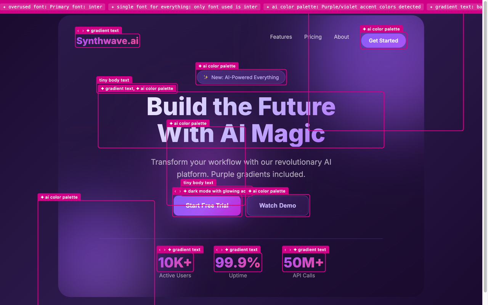

## Что такое Impeccable


[Impeccable](https://github.com/pbakaus/impeccable) — open-source навык (skill) для AI-ассистентов, который улучшает качество фронтенд-дизайна. Создан Paul Bakaus на основе Anthropic `frontend-design`, но с существенным расширением: 7 доменных reference-файлов, 23 команды и 27 детерминированных правил детекции антипаттернов.

**Ключевые цифры:**
- 17 600+ звёзд на GitHub, Apache 2.0
- +59% к качеству UI в бенчмарках без смены модели
- 55 поддерживаемых AI-инструментов (Cursor, Claude Code, Copilot, Windsurf и др.)

## Зачем WordPress-разработчику

Impeccable полезен при разработке тем и блоков WordPress:

- **Генерация DESIGN.md** — команда `/impeccable document` сканирует токены и создаёт DESIGN.md в формате Google Stitch. Готовый файл синхронизируется с `theme.json` и Tailwind — см. [DESIGN.md для WordPress](./design-md.md).
- **Дизайн-ревью блоков** — `/impeccable critique` и `/impeccable audit` проверяют UI блоков и паттернов на соответствие best practices.
- **Полировка темы** — `/impeccable polish` выравнивает компоненты под дизайн-систему.
- **Анимации и микро-взаимодействия** — `/impeccable animate` добавляет осмысленное движение в интерфейс.
- **Адаптивность** — `/impeccable adapt` проверяет и правит responsive-поведение.

## Установка

```bash
npx skills add pbakaus/impeccable -y
```

После установки навык доступен в поддерживаемых AI-инструментах как `/impeccable`.

## Основные команды

| Команда | Назначение |
|---------|------------|
| `/impeccable craft` | Полный цикл: от концепции до визуальной итерации |
| `/impeccable teach` | Создание PRODUCT.md и DESIGN.md для проекта |
| `/impeccable document` | Генерация DESIGN.md из существующего кода |
| `/impeccable shape` | Планирование UX/UI перед написанием кода |
| `/impeccable critique` | UX-ревью дизайна |
| `/impeccable audit` | Техническая проверка качества |
| `/impeccable polish` | Финальная полировка, выравнивание под дизайн-систему |
| `/impeccable bolder` | Усиление скучного дизайна |
| `/impeccable quieter` | Приглушение слишком яркого дизайна |
| `/impeccable animate` | Добавление осмысленной анимации |
| `/impeccable typeset` | Исправление шрифтов, иерархии и размеров |
| `/impeccable layout` | Исправление макета, отступов и визуального ритма |
| `/impeccable harden` | Обработка ошибок, i18n, граничные случаи |
| `/impeccable adapt` | Адаптация под разные устройства |
| `/impeccable live` | Итерация UI в браузере с HMR |

## Детектор антипаттернов

CLI-инструмент `npx impeccable detect` проверяет код на 27 детерминированных правил. 

Также доступно [Chrome DevTools-расширение](https://chromewebstore.google.com/detail/impeccable/bdkgmiklpdmaojlpflclinlofgjfpabf) для визуального аудита прямо в браузере.




```bash
# Проверка директории
npx impeccable detect src/

# Проверка URL
npx impeccable detect https://example.com

# Быстрая проверка с JSON-выводом
npx impeccable detect --fast --json .
```

**Примеры детектируемых паттернов:**
- Использование избитых шрифтов (Inter, Arial, system defaults — а также Fraunces, Geist, Mona Sans, Space Grotesk)
- Серый текст на цветном фоне
- Чисто чёрный/серый без оттенка
- Карточки, вложенные в карточки
- Italic-serif hero-заголовки (Fraunces, Recoleta, Playfair — паттерн AI-маркетинга конца 2025)
- Hero eyebrow chips (uppercase pill-лейблы над H1)

## Связка с WordPress-инструментами

### DESIGN.md + theme.json

Impeccable генерирует DESIGN.md, который служит upstream-спецификацией для `theme.json` и Tailwind. Подробнее о связке — [DESIGN.md для WordPress](./design-md.md).

### Tailwind CSS + daisyUI

При использовании [Tailwind CSS v4 + daisyUI в блочной теме](./tailwind-daisyui-wordpress.md) Impeccable помогает:
- Согласовать дизайн-токены между DESIGN.md, `theme.json` и Tailwind-конфигом
- Проверить кастомные блоки на антипаттерны
- Отполировать daisyUI-компоненты под бренд

### Дизайн-системы

Impeccable дополняет подход [дизайн-систем в WordPress](./design-systems.md): `/impeccable extract` вытягивает переиспользуемые компоненты в дизайн-систему, а `/impeccable polish` выравнивает новые компоненты под неё.

## Ключевой инсайт из бенчмарков

> Прежде чем выбрать шрифт или палитру, назови три первых инстинкта — и отвергни их.

Этот приём дал наибольший прирост качества при тестировании на gpt-5.4 и Qwen 3.6 Plus. Модели, обученные на SaaS-шаблонах, по умолчанию тяготеют к Inter, фиолетово-синим градиентам и карточкам в карточках. Явный отказ от первых инстинктов заставляет их искать более оригинальные решения.

## Ограничения

- **Расход токенов** — загрузка 7 reference-файлов добавляет значительный контекст на каждую команду
- **Субъективность** — некоторые дизайн-предпочтения могут не совпадать с вашими
- **Быстрые обновления** — версии выходят часто, но команда оперативно реагирует на issues

## Материалы и источники

- [Impeccable на GitHub](https://github.com/pbakaus/impeccable) — репозиторий, README, лицензия Apache 2.0
- [impeccable.style](https://impeccable.style/) — официальный сайт, история версий
- [Chrome DevTools-расширение](https://chromewebstore.google.com/detail/impeccable/bdkgmiklpdmaojlpflclinlofgjfpabf) — визуальный аудит в браузере
- [Обзоры сообщества](https://emelia.io/hub/impeccable-design-skill-review) — Emelia.io, Reddit r/ClaudeCode
- [DESIGN.md для WordPress](./design-md.md) — связка DESIGN.md с theme.json и Tailwind
- [Tailwind CSS v4 + daisyUI в блочной теме](./tailwind-daisyui-wordpress.md) — интеграция с WordPress
- [Дизайн-системы в WordPress](./design-systems.md) — Atomic Design и компонентный подход